# C4 Model - Planificador de Tareas Personal

Este documento describe la arquitectura del sistema utilizando el modelo C4 de Simon Brown.

---

## Nivel 1: Contexto del Sistema

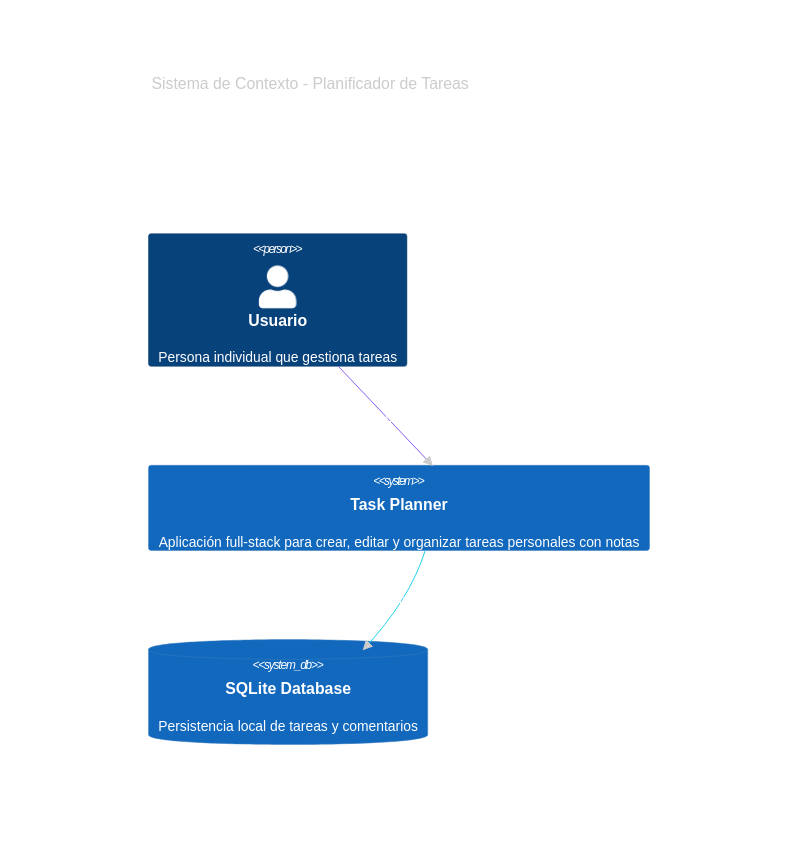

### Elementos del Contexto

| Elemento | Descripción |
|----------|-------------|
| **Usuario** | Persona individual que necesita organizar sus tareas diarias |
| **Task Planner** | Sistema SPA que permite CRUD de tareas y comentarios |
| **SQLite** | Base de datos local para persistencia sin servidor externo |

<details>
<summary><b>Código Mermaid</b></summary>

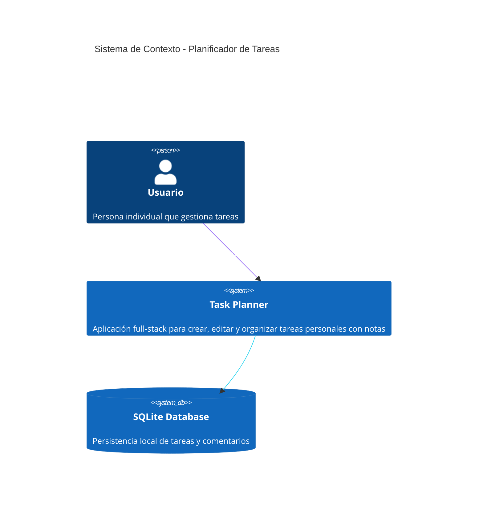

</details>

---

## Nivel 2: Contenedores

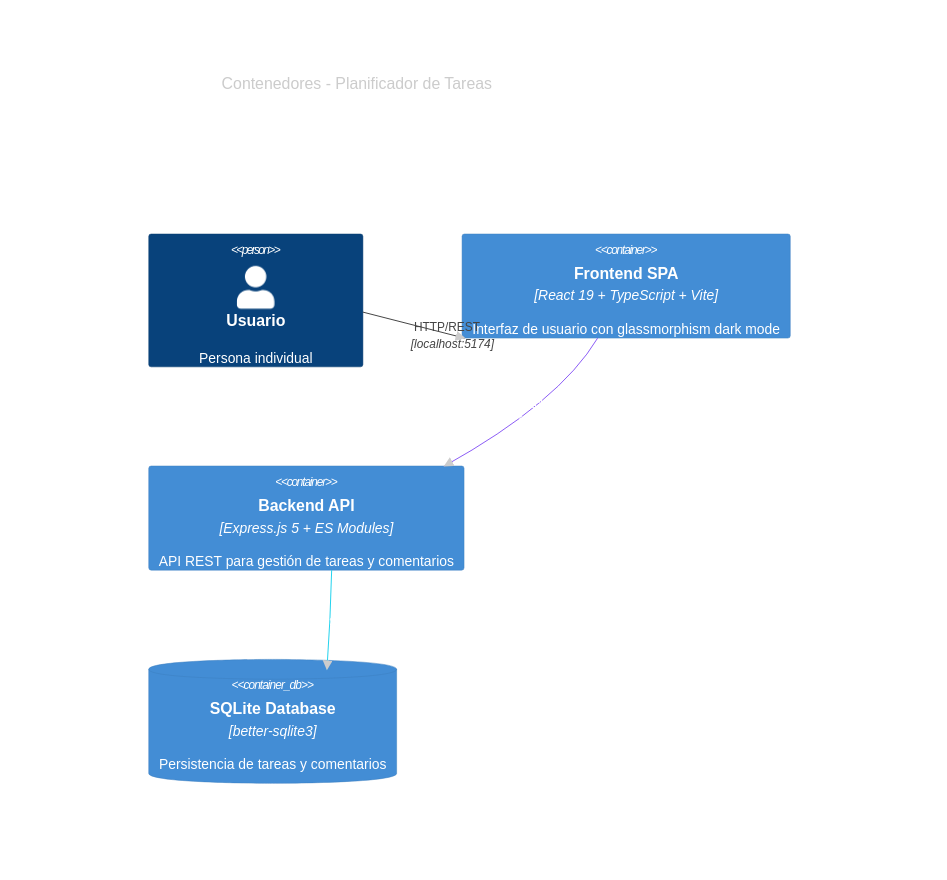

### Contenedores del Sistema

| Contenedor | Tecnología | Puerto | Responsabilidad |
|------------|------------|--------|-----------------|
| **Frontend SPA** | React 19, TypeScript, Vite | 5173/5174 | UI interactiva, estado, comunicación API |
| **Backend API** | Express.js 5, ES Modules | 3001 | Lógica de negocio, endpoints REST, acceso BD |
| **SQLite DB** | better-sqlite3 | - | Almacenamiento persistente |

<details>
<summary><b>Código Mermaid</b></summary>

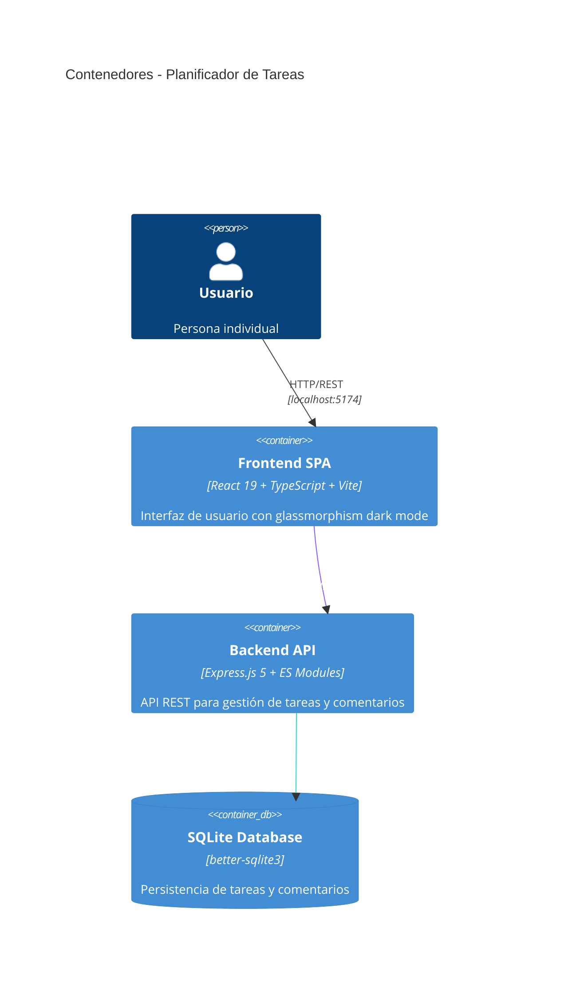

</details>

---

## Nivel 3: Componentes

### Frontend - Componentes React

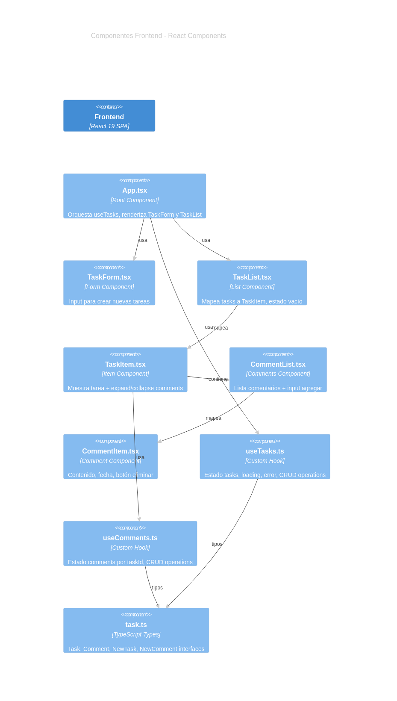

<details>
<summary><b>Código Mermaid</b></summary>

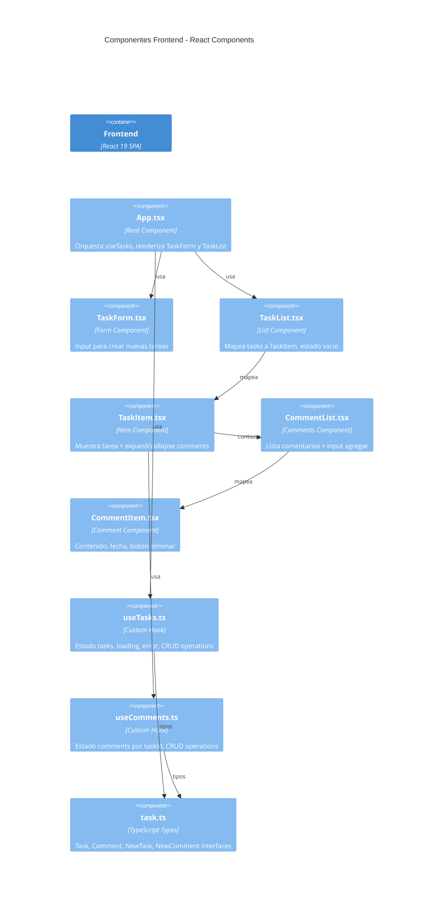

</details>

### Backend - Componentes Express

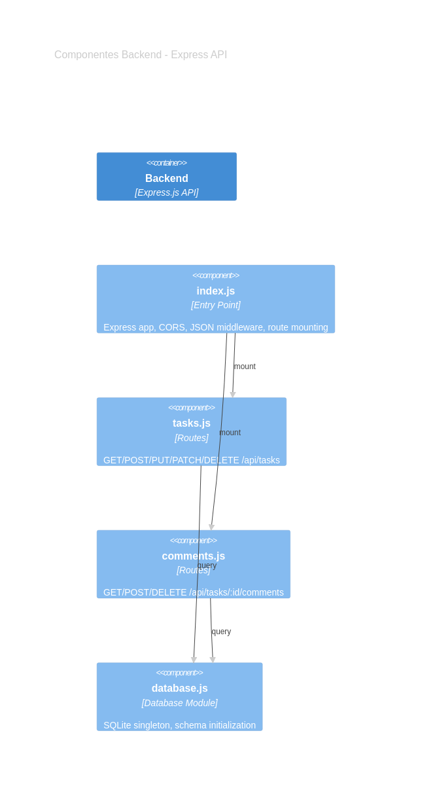

<details>
<summary><b>Código Mermaid</b></summary>

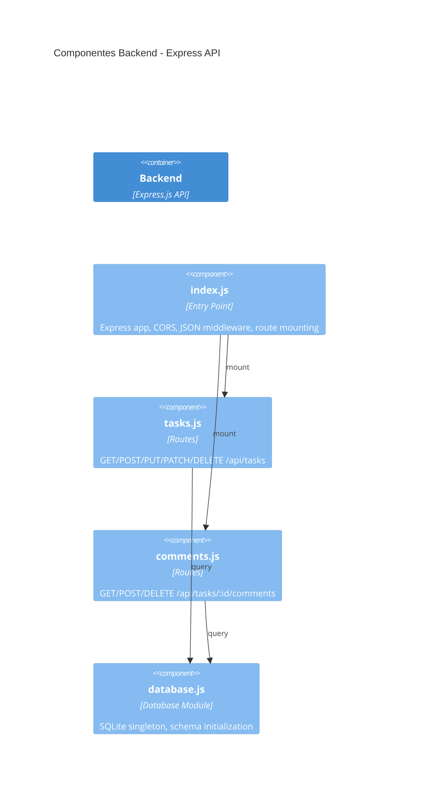

</details>

---

## Nivel 4: Flujo de Datos

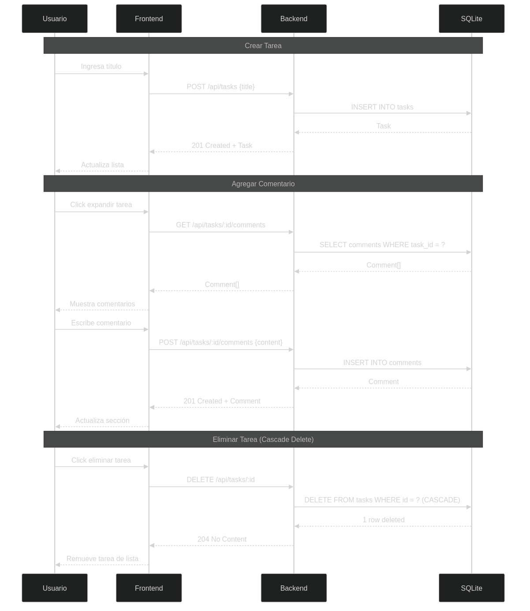

<details>
<summary><b>Código Mermaid</b></summary>

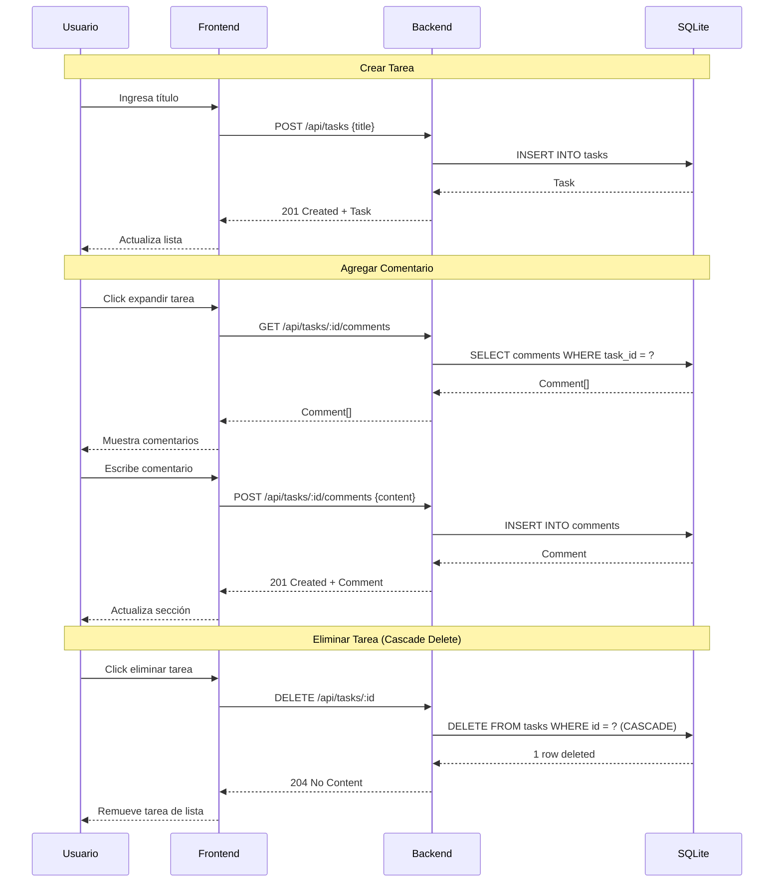

</details>

---

## Estructura de Archivos

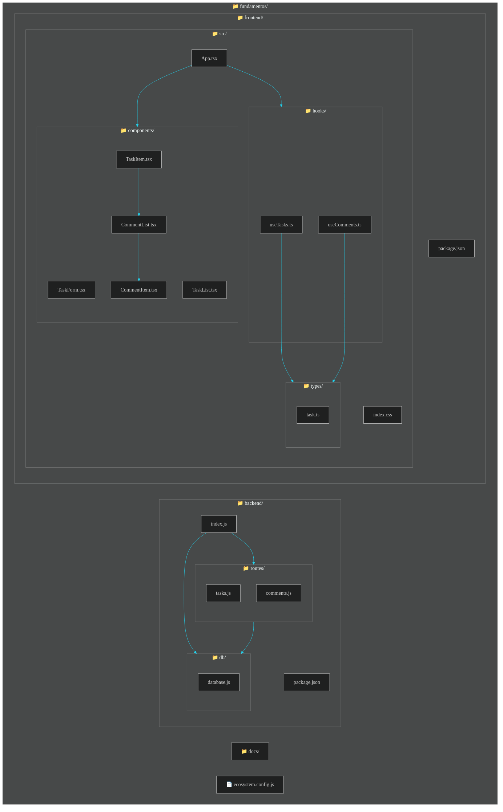

<details>
<summary><b>Código Mermaid</b></summary>

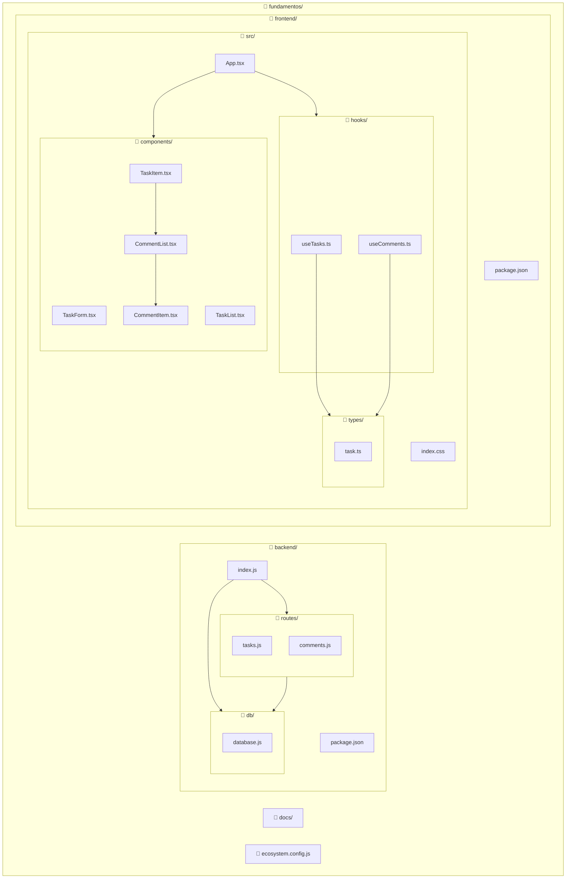

</details>

---

## API Endpoints

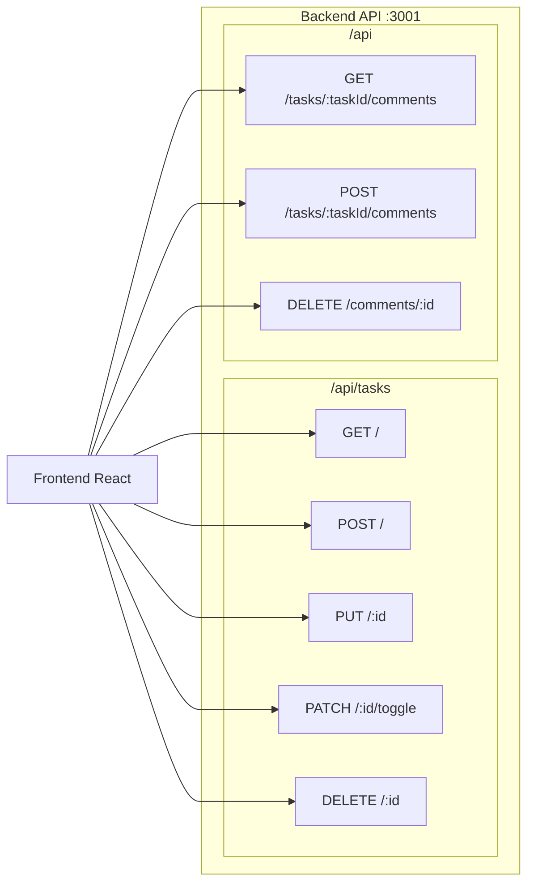

### Tabla de Endpoints

| Método | Endpoint | Descripción | Request Body | Respuesta |
|--------|----------|-------------|--------------|-----------|
| GET | `/api/tasks` | Lista todas las tareas | - | `Task[]` |
| POST | `/api/tasks` | Crea tarea | `{ title: string }` | `Task` (201) |
| PUT | `/api/tasks/:id` | Actualiza tarea | `{ title?, completed? }` | `Task` |
| PATCH | `/api/tasks/:id/toggle` | Toggle completado | - | `Task` |
| DELETE | `/api/tasks/:id` | Elimina tarea | - | 204 (CASCADE) |
| GET | `/api/tasks/:taskId/comments` | Lista comentarios | - | `Comment[]` |
| POST | `/api/tasks/:taskId/comments` | Crea comentario | `{ content: string }` | `Comment` (201) |
| DELETE | `/api/comments/:id` | Elimina comentario | - | 204 |

---

## Modelo de Datos

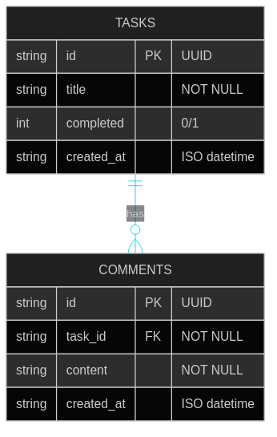

<details>
<summary><b>Código Mermaid</b></summary>

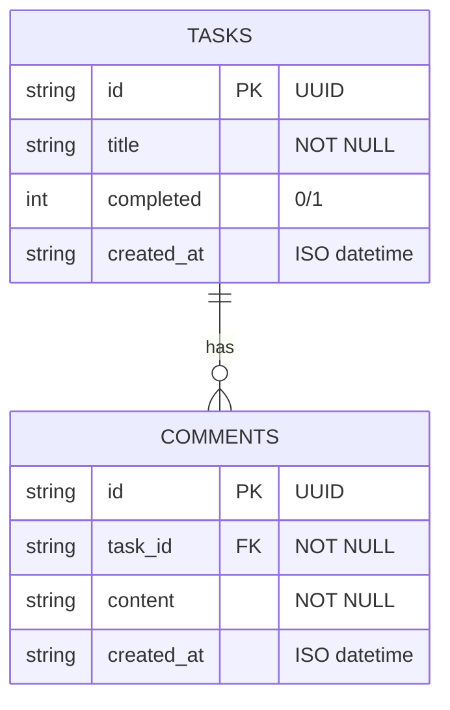

</details>

---

## Tecnologías

| Capa | Tecnología | Versión |
|------|------------|---------|
| **Frontend UI** | React | 19.x |
| **Frontend Build** | Vite | 8.x |
| **Frontend Language** | TypeScript | 5.x |
| **Frontend Router** | React Router | 7.x |
| **Backend Runtime** | Node.js | - |
| **Backend Framework** | Express | 5.x |
| **Database** | SQLite (better-sqlite3) | - |
| **IDs** | UUID v4 | - |
| **Dev Tools** | PM2, concurrently | - |

---

## Métricas del Código

| Métrica | Valor |
|---------|-------|
| **Componentes Frontend** | 5 |
| **Hooks Custom** | 2 |
| **Rutas API** | 8 |
| **Tablas BD** | 2 (tasks, comments) |
| **Lenguajes** | 2 (TypeScript, JavaScript) |

---

## Regenerar Diagramas

Para regenerar las imágenes de los diagramas:

```bash
# Instalar dependencias (si no está)
npm install -D @mermaid-js/mermaid-cli

# Generar todas las imágenes
npx mmdc -i docs/architecture/diagrams/context.mmd -o docs/architecture/diagrams/context.png -b transparent -w 1200 -H 800
npx mmdc -i docs/architecture/diagrams/containers.mmd -o docs/architecture/diagrams/containers.png -b transparent -w 1400 -H 900
npx mmdc -i docs/architecture/diagrams/components-frontend.mmd -o docs/architecture/diagrams/components-frontend.png -b transparent -w 1600 -H 1000
npx mmdc -i docs/architecture/diagrams/components-backend.mmd -o docs/architecture/diagrams/components-backend.png -b transparent -w 1200 -H 700
npx mmdc -i docs/architecture/diagrams/sequence.mmd -o docs/architecture/diagrams/sequence.png -b transparent -w 1400 -H 900
npx mmdc -i docs/architecture/diagrams/structure.mmd -o docs/architecture/diagrams/structure.png -b transparent -w 1400 -H 800
npx mmdc -i docs/architecture/diagrams/er-model.mmd -o docs/architecture/diagrams/er-model.png -b transparent -w 1000 -H 600
```
